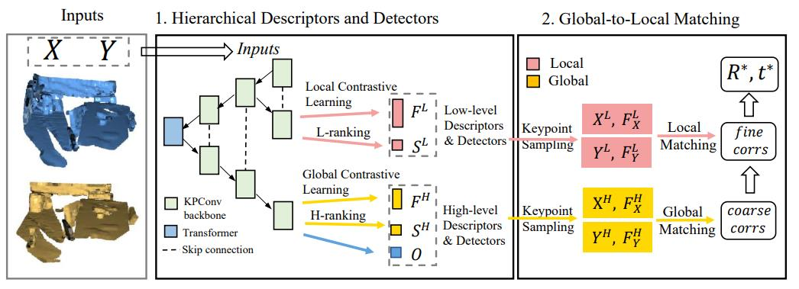

# HD2Reg: Hierarchical Descriptors and Detectors for Point Cloud Registration

**Our paper is accepted by IEEE Intelligent Vehicles Symposium 2023 (IV 2023)**

[arxiv](). The camera_ready version of our paper has been released.

# Autuor
Canhui Tang [1], Yiheng Li [1], Shaoyi Du [1], Guofa Wang [2], and Zhiqiang Tian [2]

1: Institute of Artificial Intelligence and Robotics, Xi’an Jiaotong University, Xi’an, China

2: School of Software Engineering, Xi’an Jiaotong University, Xi’an, China

Corresponding E-mail: 2225705604@qq.com

# Introduction
Feature Descriptors and Detectors are two main components of feature-based point cloud registration. However, little attention has been drawn to the explicit representation of local and global semantics in the learning of descriptors and detectors. In this paper, we present a framework that explicitly extracts dual-level descriptors and detectors and performs coarse-to-fine matching with them.  First, to explicitly learn local and global semantics, we propose a hierarchical contrastive learning strategy, training the robust matching ability of high-level descriptors, and refining the local feature space using low-level descriptors. Furthermore, we propose to learn dual-level saliency maps that extract two groups of keypoints in two different senses. To overcome the weak supervision of binary matchability labels, we propose a ranking strategy to label the significance ranking of keypoints, and thus provide more fine-grained supervision signals. Finally, we propose a global-to-local matching scheme to obtain robust and accurate correspondences by leveraging the complementary dual-level features. Quantitative experiments on 3DMatch and KITTI odometry datasets show that our method achieves robust and accurate point cloud registration and outperforms recent keypoint-based methods. 



#Requirements and datasets

We use the same dependences and datasets as [Predator]([prs-eth/OverlapPredator: [CVPR 2021, Oral\] PREDATOR: Registration of 3D Point Clouds with Low Overlap. (github.com)](https://github.com/prs-eth/OverlapPredator)). For convenience, we give the following command.

```
conda create -n HD2Reg python=3.8
conda activate HD2Reg
cd HD2Reg
pip install -r requirements.txt
cd cpp_wrappers; sh compile_wrappers.sh; cd ..
sh scripts/download_data.sh  
```

# Train

```
python main.py configs/train/indoor.yaml
```

The trained model will be saved under "snapshot/indoor/checkpoints".

# Evaluate

```
python main.py configs/test/indoor.yaml
python scripts/evaluate_predator.py --source_path snapshot/indoor/3DMatch
```

The evaluation results can be found under "./est_traj". You can change the parameter "n_points" to decide how many correspondences to sample. Our pretrained model is already under "./weights" directory.

### Citation

If you find this code useful for your work or use it in your project, please consider citing:

# Acknowledgements

In this project we use (parts of) the official implementations of [Predator]([prs-eth/OverlapPredator: [CVPR 2021, Oral\] PREDATOR: Registration of 3D Point Clouds with Low Overlap. (github.com)](https://github.com/prs-eth/OverlapPredator)). We sincerely thank the authors.